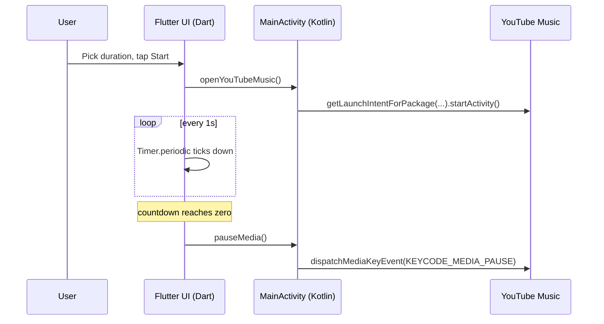

# Sleep Timer for YouTube Music

An Android sleep timer that opens YouTube Music, counts down, and pauses playback when time runs out.

Falling asleep to music on Android is awkward: most sleep timers live inside individual player apps, and YouTube Music's own timer is buried and limited. This is a single-purpose app that does one thing well — you pick a duration, it launches YouTube Music, and when the countdown reaches zero it issues a system media-pause so the music stops on its own.

## Features

- Duration presets: 10, 15, 20, 30, 45, 60, 90 and 120 minutes.
- Custom duration via a numeric dialog for any positive number of minutes.
- One tap starts the timer **and** launches the YouTube Music app.
- Live countdown (`H:MM:SS` / `MM:SS`) with monospaced, tabular digits.
- On expiry, sends a system `MEDIA_PAUSE` key event that pauses the active media session.
- Cancel an in-progress timer at any time.
- Material 3 dark theme seeded with YouTube red.

## Tech stack

| Layer | Technology |
|-------|-----------|
| UI / logic | Flutter (`>=3.10.0`), Dart SDK `>=3.0.0 <4.0.0` |
| Design | Material 3 (`useMaterial3: true`), dark color scheme |
| Native bridge | Flutter `MethodChannel` (`sleep_timer/native`) |
| Android native | Kotlin `1.9.10`, `AudioManager`, `PackageManager` |
| Build | Android Gradle Plugin `8.1.0`, Gradle `8.3`, Java 17 |
| SDK targets | `minSdk 21`, `targetSdk 34`, `compileSdk 34` |

Runtime dependencies are intentionally minimal: only the Flutter SDK and `cupertino_icons`.

## Architecture

The Dart layer owns the timer state and UI; all platform-specific work happens in Kotlin behind a single method channel.

```
Flutter (Dart)                         Android (Kotlin)
lib/main.dart                          MainActivity.kt
  countdown (Timer.periodic)   ⇄       openYouTubeMusic  → launch intent
  UI + state         MethodChannel     pauseMedia        → media key event
                  "sleep_timer/native"
```



Two native methods are exposed over the channel:

- `openYouTubeMusic` — resolves `com.google.android.apps.youtube.music` via `PackageManager.getLaunchIntentForPackage` and starts it, returning a `NOT_INSTALLED` error if the app is absent.
- `pauseMedia` — dispatches a `KEYCODE_MEDIA_PAUSE` down/up pair through `AudioManager.dispatchMediaKeyEvent`, pausing whatever media session currently holds audio focus.

The `AndroidManifest.xml` declares the YouTube Music package in a `<queries>` block so package visibility works on Android 11+ (API 30+).

## Getting started

### Prerequisites

- Flutter SDK `>=3.10.0` with Dart 3.x (`flutter --version`).
- Android SDK with `compileSdk 34` installed, and Java 17.
- A physical device or emulator running Android 5.0 (API 21) or newer, **with the YouTube Music app installed** — the app launches and controls it, it does not stream anything itself.

### Install and run

```bash
flutter pub get
flutter run           # debug build on a connected device/emulator
```

### Static analysis

```bash
flutter analyze
```

### Build a release APK

```bash
flutter build apk --release
# output: build/app/outputs/flutter-apk/app-release.apk
```

## Project structure

```
sleep-timer-ytmusic/
├── lib/
│   └── main.dart                  # Flutter UI, countdown logic, channel calls
├── android/
│   ├── app/
│   │   ├── build.gradle           # SDK levels, Java 17, signing
│   │   └── src/main/
│   │       ├── AndroidManifest.xml            # <queries> for YT Music, launcher activity
│   │       └── kotlin/com/example/sleeptimer/
│   │           └── MainActivity.kt            # native method-channel handlers
│   ├── build.gradle               # repositories, build dirs
│   └── settings.gradle            # AGP 8.1.0, Kotlin 1.9.10 plugins
└── pubspec.yaml                   # Flutter/Dart metadata and dependencies
```

There is no `ios/`, `web/` or desktop scaffolding — this is an Android-only project.

## Status and limitations

This is a personal, single-purpose app. Known constraints, all by design or platform reality:

- **Android only.** No iOS or web target exists.
- **Timer is in-process.** The countdown runs on a Dart `Timer.periodic` inside the app. There is no foreground service, wake lock or `AlarmManager`, so the app must stay alive for the pause to fire — if Android kills the process, the timer will not trigger. The in-app copy reflects this.
- **Pause is system-wide.** `pauseMedia` sends a global media-pause key, which pauses the active media session (expected to be YouTube Music) rather than being scoped to a specific app.
- **Release signing uses the debug keystore**, so the produced APK is fine for sideloading but not ready for Play Store distribution as-is.
- **UI copy is in Portuguese (pt-BR)** and not yet localized.
- **No automated tests.**

## License

Released under the [MIT License](LICENSE).
